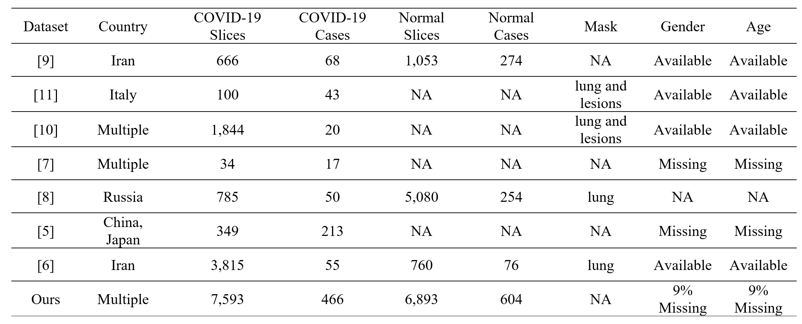
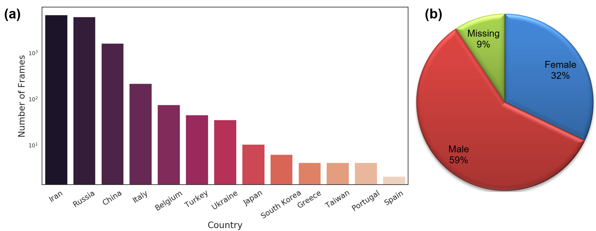

# Curated_Covid_CT
We built a **large lung CT scan** dataset for **COVID-19** by **curating data from 7 public datasets** listed in the references. These datasets have been publicly used in COVID-19 diagnosis literature and proven their efficiency in deep learning applications. Therefore, the merged dataset is expected to improve the **generalization ability of deep learning** methods by learning from all these resources together. 

To ensure the dataset quality, we have removed the closed lung normal slices that do not carry information about inside lung manifestations. Additionally, we did not include images lacking clear class labels or patient information. In total, we have gathered **7,593 COVID-19 images** from **466 patients**, 6,893 normal images from 604 patients, and 2,618 CAP images from 60 patients. All of our CAP images are from Afshar et al. dataset, in which 25 cases are already annotated. Our radiologist has annotated the remaining 35 CT scan volumes. This is the largest COVID-19 lung CT dataset so far, to the best of our knowledge. 

The number of frames for the COVID-19 and Normal classes and available metadata in each dataset are summarized in the following Table. NA stands for not available, and Missing is available but with missing values. 




The average age is 51.2, 52.8, and 64.3 for COVID-19, Normal, and CAP cases, respectively. The country and gender distributions on the whole dataset are shown in the following Figure.


The dataset can be downloaded from the followig Kaggle link: 
https://www.kaggle.com/maedemaftouni/large-covid19-ct-slice-dataset

** COVID-19 cases meta-data:
```
meta_data_covid.xlsx
```
** Normal cases meta-data:
```
meta_data_normal.xlsx
```
** CAP cases meta-data:
```
meta_data_cap.xlsx
```

### Citation
If you use this dataset for your research, please cite:

Maftouni, M., Law, A.C, Shen, B., Zhou, Y., Yazdi, N., and Kong, Z.J. “A Robust Ensemble-Deep Learning Model for COVID-19 Diagnosis based on an Integrated CT Scan Images Database,” Proceedings of the 2021 Industrial and Systems Engineering Conference, Virtual Conference, May 22-25, 2021.


### References  
*	J. Zhao, Y. Zhang, X. He, and P. Xie, "COVID-CT-Dataset: a CT scan dataset about COVID-19," arXiv preprint arXiv:2003.13865, 2020.
*	P. Afshar et al., "COVID-CT-MD: COVID-19 Computed Tomography (CT) Scan Dataset Applicable in Machine Learning and Deep Learning," arXiv preprint arXiv:2009.14623, 2020.
*	J. P. Cohen, P. Morrison, L. Dao, K. Roth, T. Q. Duong, and M. Ghassemi, "Covid-19 image data collection: Prospective predictions are the future," arXiv preprint arXiv:2006.11988, 2020.
*	S. Morozov et al., "MosMedData: Chest CT Scans With COVID-19 Related Findings Dataset," arXiv preprint arXiv:2005.06465, 2020.
*	M. Rahimzadeh, A. Attar, and S. M. Sakhaei, "A Fully Automated Deep Learning-based Network For Detecting COVID-19 from a New And Large Lung CT Scan Dataset," medRxiv, 2020.
*	M. Jun et al., "COVID-19 CT Lung and Infection Segmentation Dataset," Zenodo, Apr, vol. 20, 2020.
*	"COVID-19." 2020. [Online] http://medicalsegmentation.com/covid19/ [Accessed 23 December, 2020].

